# Arquitectura

DrawPad usa **Clean Architecture** con **MVVM** en la capa de presentación.
El porqué está en [ADR 0003](adr/0003-clean-architecture-mvvm.md); aquí se
explica cómo está montado.

## 1. La idea en una frase

El código se separa en capas y **las dependencias solo apuntan hacia dentro**:
la interfaz y los detalles técnicos (PencilKit, base de datos, Fotos) dependen de
las reglas de la app, nunca al revés.

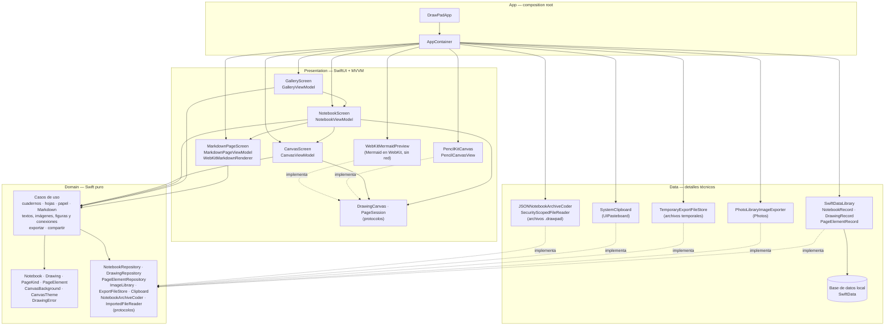
```mermaid
flowchart TB
    subgraph APP["App — composition root"]
        A1["DrawPadApp"]
        A2["AppContainer"]
    end
    subgraph PRES["Presentation — SwiftUI + MVVM"]
        G1["GalleryScreen<br/>GalleryViewModel"]
        N1["NotebookScreen<br/>NotebookViewModel"]
        P1["CanvasScreen<br/>CanvasViewModel"]
        P3["DrawingCanvas · PageSession<br/>(protocolos)"]
        P4["PencilKitCanvas<br/>PencilCanvasView"]
        P5["WebKitMermaidPreview<br/>(Mermaid en WebKit, sin red)"]
        P6["MarkdownPageScreen<br/>MarkdownPageViewModel<br/>WebKitMarkdownRenderer"]
    end
    subgraph DOM["Domain — Swift puro"]
        D1["Casos de uso<br/>cuadernos · hojas · papel · Markdown<br/>textos, imágenes, figuras y conexiones<br/>exportar · compartir"]
        D2["Notebook · Drawing · PageKind · PageElement<br/>CanvasBackground · CanvasTheme<br/>DrawingError"]
        D3["NotebookRepository · DrawingRepository<br/>PageElementRepository<br/>ImageLibrary · ExportFileStore · Clipboard<br/>NotebookArchiveCoder · ImportedFileReader<br/>(protocolos)"]
    end
    subgraph DATA["Data — detalles técnicos"]
        T1["SwiftDataLibrary<br/>NotebookRecord · DrawingRecord<br/>PageElementRecord"]
        T2["PhotoLibraryImageExporter<br/>(Photos)"]
        T4["TemporaryExportFileStore<br/>(archivos temporales)"]
        T5["SystemClipboard<br/>(UIPasteboard)"]
        T6["JSONNotebookArchiveCoder<br/>SecurityScopedFileReader<br/>(archivos .drawpad)"]
        T3[("Base de datos local<br/>SwiftData")]
    end

    G1 --> N1
    N1 --> P1
    N1 --> P6
    P6 --> D1
    G1 --> D1
    N1 --> D1
    N1 --> P3
    P1 --> P3
    P1 --> D1
    P4 -. implementa .-> P3
    P5 -. implementa .-> P3
    D1 --> D2
    D1 --> D3
    T1 -. implementa .-> D3
    T2 -. implementa .-> D3
    T4 -. implementa .-> D3
    T5 -. implementa .-> D3
    T6 -. implementa .-> D3
    T1 --> T3
    A1 --> A2
    A2 --> G1
    A2 --> N1
    A2 --> P1
    A2 --> P4
    A2 --> P5
    A2 --> P6
    A2 --> T1
    A2 --> T2
    A2 --> T4
    A2 --> T5
    A2 --> T6
```

Las flechas continuas son "usa"; las punteadas, "implementa". Fíjate en que
**ninguna flecha sale de Domain** hacia otra capa.

## 2. Capas

| Capa | Carpeta | Qué contiene | Puede importar |
| ---- | ------- | ------------ | -------------- |
| **Domain** | `DrawPad/Domain` | Entidades, errores de negocio, protocolos (puertos) y casos de uso. | Solo `Foundation`. |
| **Data** | `DrawPad/Data` | Implementaciones de los puertos: base de datos SwiftData y app Fotos. | `Foundation`, `SwiftData`, `Photos`, Domain. |
| **Presentation** | `DrawPad/Presentation` | Vistas SwiftUI, ViewModel y el adaptador de PencilKit. | `SwiftUI`, `PencilKit`, `UIKit`, Domain. |
| **App** | `DrawPad/App` | Punto de entrada y creación de dependencias. | Todo. |

Reglas que mantienen la arquitectura limpia:

1. **Domain no importa** `SwiftUI`, `UIKit`, `PencilKit`, `SwiftData` ni `Photos`.
2. **Presentation no conoce Data.** Los ViewModel reciben casos de uso; no
   saben si los dibujos van a una base de datos o a la nube.
3. **Solo `PencilKitCanvas` y `PencilCanvasView` tocan PencilKit.**
4. **Solo `AppContainer` crea implementaciones concretas.**
5. Data traduce sus errores técnicos a `DrawingError` antes de devolverlos.
6. **`DrawingRecord` (el modelo de SwiftData) no sale de Data.** El resto de
   la app usa la entidad `Drawing`.

## 3. Estructura de carpetas

```text
DrawPad/
├── App/
│   ├── DrawPadApp.swift            Punto de entrada (@main)
│   └── AppContainer.swift          Crea y conecta las dependencias
├── Domain/
│   ├── Entities/
│   │   ├── Notebook.swift          Un cuaderno: título, fecha y tapa
│   │   ├── NotebookCover.swift     La tapa: color, estilo y dibujo (CoverDrawing)
│   │   ├── NotebookSummary.swift   Lo justo para la galería: tapa, hojas, actividad
│   │   ├── Drawing.swift           Una hoja: trazos, miniatura, papel, fechas
│   │   ├── DrawingSummary.swift    Lo justo para listar hojas (sin trazos)
│   │   ├── PageKind.swift          Tipo de hoja: de dibujo o Markdown
│   │   ├── PageElement.swift       Un texto, imagen, figura (DiagramShape), conexión (Connector) o diagrama Mermaid
│   │   ├── ClipboardContent.swift  Lo que se puede pegar: texto o imagen
│   │   ├── CanvasBackground.swift  Patrón del papel: blanco, cuadrícula, líneas, puntos
│   │   ├── CanvasTheme.swift       Papel claro u oscuro
│   │   ├── ExportFormat.swift      Formatos para compartir: PNG o PDF
│   │   └── NotebookBundle.swift    Un cuaderno completo para exportar o importar
│   ├── Errors/DrawingError.swift   Errores con mensaje para el usuario
│   ├── Repositories/               Puertos (protocolos)
│   │   ├── NotebookRepository.swift
│   │   ├── DrawingRepository.swift
│   │   ├── PageElementRepository.swift
│   │   ├── Clipboard.swift
│   │   ├── ImageLibrary.swift
│   │   ├── ExportFileStore.swift
│   │   ├── NotebookArchiveCoder.swift  Cuaderno ↔ archivo
│   │   └── ImportedFileReader.swift    Leer un archivo elegido por el usuario
│   └── UseCases/                   Una acción de negocio por archivo
│       ├── ListNotebooksUseCase.swift
│       ├── CreateNotebookUseCase.swift
│       ├── LoadNotebookUseCase.swift
│       ├── RenameNotebookUseCase.swift
│       ├── DeleteNotebookUseCase.swift
│       ├── ChangeCoverUseCase.swift
│       ├── ExportNotebookUseCase.swift
│       ├── ImportNotebookUseCase.swift      Si ya existe, lo reemplaza
│       ├── ListPagesUseCase.swift
│       ├── AddPageUseCase.swift
│       ├── DeletePageUseCase.swift
│       ├── LoadDrawingUseCase.swift
│       ├── SaveDrawingUseCase.swift
│       ├── ChangeBackgroundUseCase.swift
│       ├── ListPageElementsUseCase.swift
│       ├── AddTextElementUseCase.swift
│       ├── AddImageElementUseCase.swift
│       ├── PasteElementUseCase.swift
│       ├── UpdateElementTextUseCase.swift
│       ├── MoveElementUseCase.swift
│       ├── DeleteElementUseCase.swift         Al quitar una figura, quita sus conexiones
│       ├── AddShapeElementUseCase.swift
│       ├── RotateShapeUseCase.swift
│       ├── ConnectElementsUseCase.swift
│       ├── AddMermaidElementUseCase.swift   Guarda un diagrama ya dibujado
│       ├── UpdateMermaidElementUseCase.swift
│       ├── AddMarkdownPageUseCase.swift     Hoja Markdown nueva, con plantilla de spec
│       ├── SaveMarkdownUseCase.swift
│       ├── ImportMarkdownPageUseCase.swift  Un .md como hoja nueva
│       ├── ExportMarkdownUseCase.swift      La hoja como .md
│       ├── ExportDrawingUseCase.swift
│       └── PrepareShareFileUseCase.swift
├── Data/
│   ├── Persistence/
│   │   ├── NotebookRecord.swift    Modelo de SwiftData de un cuaderno (@Model)
│   │   ├── DrawingRecord.swift     Modelo de SwiftData de una hoja (@Model)
│   │   └── PageElementRecord.swift Modelo de SwiftData de un texto o una imagen (@Model)
│   ├── Repositories/SwiftDataLibrary.swift   Los tres repositorios, una base de datos
│   ├── Archive/JSONNotebookArchiveCoder.swift  Formato .drawpad (JSON versionado)
│   └── Gateways/
│       ├── PhotoLibraryImageExporter.swift
│       ├── TemporaryExportFileStore.swift
│       ├── SystemClipboard.swift   Portapapeles del sistema
│       ├── FixedClipboard.swift    Portapapeles fijo para las pruebas de interfaz
│       └── SecurityScopedFileReader.swift  Lee archivos de Archivos / iCloud Drive
├── Presentation/
│   ├── Gallery/
│   │   ├── GalleryScreen.swift     Cuadrícula de cuadernos y navegación
│   │   ├── GalleryViewModel.swift  Listar, crear, renombrar, eliminar cuadernos
│   │   ├── NotebookCard.swift      Tarjeta: tapa, hojas y fecha
│   │   ├── NotebookCoverView.swift Dibuja la tapa a partir de color, estilo y título
│   │   ├── CoverEditorSheet.swift  Elegir estilo, color y dibujo de la tapa
│   │   ├── CoverDrawingScreen.swift    Dibujar la portada con el Pencil
│   │   ├── CoverDrawingViewModel.swift Estado de esa pantalla
│   │   ├── CoverDrawingModule.swift    Su ViewModel y su lienzo, juntos
│   │   └── NotebookCover+Presentation.swift  Nombre y tono de cada color y estilo
│   ├── Mermaid/
│   │   ├── MermaidPreview.swift            Puerto: dibujar Mermaid y sacar la imagen
│   │   ├── WebKitMermaidPreview.swift      Mermaid dentro de WebKit, sin red
│   │   ├── MermaidPreviewView.swift        La vista web en SwiftUI
│   │   ├── MermaidEditorViewModel.swift    Texto, vista previa y errores
│   │   ├── MermaidEditorModule.swift       ViewModel + vista web; petición de editor
│   │   └── MermaidEditorSheet.swift        Editor con vista previa
│   ├── Markdown/
│   │   ├── WebKitMarkdownRenderer.swift    marked + Mermaid en WebKit, sin red
│   │   ├── MarkdownWebView.swift           La vista web en SwiftUI
│   │   ├── MarkdownPageViewModel.swift     Ver / Editar, autoguardado, exportar .md
│   │   ├── MarkdownPageModule.swift        ViewModel + vista web de una hoja abierta
│   │   └── MarkdownPageScreen.swift        Documento formateado o texto
│   ├── Notebook/
│   │   ├── NotebookScreen.swift    Cuaderno abierto: hoja actual y controles de hojas
│   │   └── NotebookViewModel.swift Pasar, añadir y eliminar hojas
│   ├── Canvas/
│   │   ├── CanvasScreen.swift      Vista: lienzo + barra de acciones
│   │   ├── CanvasViewModel.swift   Estado y acciones de una hoja
│   │   ├── CanvasModule.swift      ViewModel + lienzo de una hoja abierta
│   │   ├── PageSession.swift       Puerto: lo que el cuaderno pide a una hoja abierta
│   │   ├── CanvasPreferences.swift Ajustes que se mantienen entre hojas
│   │   ├── DrawingCanvas.swift     Puerto: lo que el ViewModel pide al lienzo
│   │   ├── PencilKitCanvas.swift   Adaptador de PencilKit
│   │   ├── CanvasGeometry.swift    Cuentas del zoom: tamaño de hoja y posición del papel
│   │   ├── StrokeSmoother.swift    Suavizado de trazos (media móvil sobre puntos)
│   │   ├── PageElementsLayer.swift Capa de textos, imágenes, figuras y conexiones bajo los trazos
│   │   ├── DiagramGeometry.swift   Cuentas de las conexiones (de borde a borde, puntas, toques)
│   │   ├── DiagramRenderer.swift   Dibuja figuras y conexiones (pantalla y exportación)
│   │   ├── ShapeKind+Presentation.swift    Nombre e icono de cada figura
│   │   ├── PageElementStyle.swift  Tipografía de los textos y dibujo al exportar
│   │   ├── PageElementUseCases.swift       Casos de uso de elementos, agrupados
│   │   ├── TextEditorRequest.swift         Petición de abrir el editor de texto
│   │   ├── TextElementEditorSheet.swift    Escribir un cuadro de texto con el teclado
│   │   ├── CanvasBackgroundPattern.swift        Dibuja la baldosa de cada papel
│   │   ├── CanvasBackground+Presentation.swift  Título e icono de cada papel
│   │   └── PencilCanvasView.swift  Puente SwiftUI ↔ UIKit
│   └── Common/
│       ├── AlertMessage.swift
│       ├── SharedFile.swift        Archivo listo para la hoja de compartir
│       ├── ActivityView.swift      Hoja de compartir de iOS
│       ├── UTType+DrawPad.swift    Tipo de archivo .drawpad
│       └── EditingCapability.swift Qué se puede cambiar (EditingCapabilities): todo en el iPad; cuadernos, Markdown y diagramas en el iPhone
└── Resources/
    ├── Assets.xcassets             Icono de la app
    ├── Mermaid/                    mermaid.min.js 11.17.2 (MIT) y su licencia
    └── Markdown/                   marked.umd.js 18.2.1 (MIT) y su licencia

DrawPadTests/
├── Doubles/                        Falsos: biblioteca, lienzo, hoja abierta, Fotos, archivos
├── Domain/
│   ├── UseCasesTests.swift
│   ├── NotebookArchiveUseCasesTests.swift
│   ├── MarkdownPageUseCasesTests.swift
│   └── PageElementUseCasesTests.swift
├── Data/
│   ├── SwiftDataLibraryTests.swift             Base de datos real en memoria
│   ├── JSONNotebookArchiveCoderTests.swift     Escribir y leer .drawpad
│   └── TemporaryExportFileStoreTests.swift
└── Presentation/
    ├── GalleryViewModelTests.swift
    ├── NotebookViewModelTests.swift
    ├── CanvasViewModelTests.swift
    ├── CoverDrawingViewModelTests.swift
    ├── MermaidEditorViewModelTests.swift
    ├── WebKitMermaidPreviewTests.swift      Mermaid real en WebKit (integración)
    ├── MarkdownPageViewModelTests.swift
    ├── WebKitMarkdownRendererTests.swift    marked y Mermaid reales en WebKit
    ├── CanvasGeometryTests.swift
    ├── DiagramGeometryTests.swift
    └── StrokeSmootherTests.swift

DrawPadUITests/
├── DrawPadUITestCase.swift         Base: arranca la app y utilidades comunes
├── NotebookUITests.swift           Galería, portada y exportar
├── PageUITests.swift               Hojas (dibujo y Markdown) y compartir
├── CanvasUITests.swift             Lienzo: dedo, deshacer, papel, suavizar, zoom
├── TextAndImageUITests.swift       Cuadros de texto e imágenes pegadas
├── DiagramUITests.swift            Figuras, conexiones y Mermaid
├── PhoneUITests.swift              Modo iPhone (cuadernos, Markdown y diagramas, sin trazos), con -phoneMode
└── XCUIApplication+ContextMenu.swift  Pulsación larga con un reintento
```

> **Sobre los nombres:** en la interfaz se habla de **cuadernos** y **hojas**.
> En el código, el cuaderno es `Notebook` y la hoja es `Drawing` (así se
> llamaba cuando cada dibujo era independiente; se conserva para no renombrar
> la tabla de la base de datos).

## 4. Tipos y relaciones


```mermaid
classDiagram
    direction LR

    class GalleryScreen {
        <<SwiftUI View>>
        -openNotebook NotebookViewModel?
    }
    class GalleryViewModel {
        <<Observable>>
        +notebooks NotebookSummary[]
        +alert AlertMessage?
        +load()
        +create() UUID?
        +rename(id, title)
        +changeCover(id, cover)
        +export(id)
        +importNotebook(from: URL)
        +delete(id)
    }
    class NotebookScreen {
        <<SwiftUI View>>
    }
    class NotebookViewModel {
        <<Observable>>
        +title String
        +pages DrawingSummary[]
        +currentIndex Int
        +session PageSession?
        +pageLabel String
        +onAppear()
        +goToPreviousPage()
        +goToNextPage()
        +addPage(kind)
        +importMarkdown(from: URL)
        +deleteCurrentPage()
        +flushPendingSave()
    }
    class PageSession {
        <<protocol>>
        +flushPendingSave()
        +discardPendingSave()
    }
    class MarkdownPageModule {
        +viewModel MarkdownPageViewModel
        +renderer WebKitMarkdownRenderer
    }
    class MarkdownPageViewModel {
        <<Observable>>
        +text String
        +mode read · edit
        +updateText(texto)
        +export()
    }
    class CanvasModule {
        +viewModel CanvasViewModel
        +canvas PencilKitCanvas
    }
    class CanvasScreen {
        <<SwiftUI View>>
    }
    class MarkdownPageScreen {
        <<SwiftUI View>>
    }
    class CanvasViewModel {
        <<Observable>>
        +isFingerDrawingEnabled Bool
        +background CanvasBackground
        +theme CanvasTheme
        +isExporting Bool
        +alert AlertMessage?
        +sharedFile SharedFile?
        +elements PageElement[]
        +selectedElementID UUID?
        +isArrangingElements Bool
        +textEditor TextEditorRequest?
        +beginNewText()
        +commitText(text, request)
        +paste()
        +setArrangingElements(Bool)
        +beginEditingSelectedText()
        +deleteSelectedElement()
        +insertShape(ShapeKind)
        +rotateSelectedShape()
        +beginConnecting(ConnectorStyle)
        +cancelConnecting()
        +onAppear()
        +undo()
        +redo()
        +smoothStrokes()
        +toggleFingerDrawing()
        +setBackground(CanvasBackground)
        +setTheme(CanvasTheme)
        +clear()
        +export()
        +share(ExportFormat)
        +flushPendingSave()
        +discardPendingSave()
    }
    class CanvasPreferences {
        <<Observable>>
        +isFingerDrawingEnabled Bool
    }
    class DrawingCanvas {
        <<protocol>>
        +onDrawingChanged
        +onElementMoved
        +onElementSelected
        +isEmpty Bool
        +visibleCenter CGPoint
        +showElements(elements, selectedID)
        +setArrangingElements(Bool)
        +currentData() Data
        +load(Data)
        +clear()
        +undo()
        +redo()
        +smoothStrokes()
        +setFingerDrawingEnabled(Bool)
        +setBackground(CanvasBackground, CanvasTheme)
        +setPaperColor(CoverColor)
        +renderStrokesPNG() Data?
        +renderPNG() Data?
        +renderPDF() Data?
        +renderThumbnail() Data?
    }
    class PencilKitCanvas {
        +view UIView
        +showToolPicker()
    }
    class UseCases {
        <<Domain>>
        ListNotebooks · CreateNotebook
        LoadNotebook · RenameNotebook
        DeleteNotebook · ChangeCover
        ExportNotebook · ImportNotebook
        ListPages · AddPage · DeletePage
        LoadDrawing · SaveDrawing
        ChangeBackground
        ListPageElements · AddText · AddImage
        Paste · UpdateText · Move · DeleteElement
        AddShape · RotateShape · ConnectElements
        AddMermaid · UpdateMermaid
        AddMarkdownPage · SaveMarkdown
        ImportMarkdownPage · ExportMarkdown
        ExportDrawing · PrepareShareFile
    }
    class NotebookRepository {
        <<protocol>>
        +listNotebooks() NotebookSummary[]
        +findNotebook(id) Notebook?
        +save(Notebook)
        +deleteNotebook(id)
    }
    class DrawingRepository {
        <<protocol>>
        +listDrawings(notebookID) DrawingSummary[]
        +findDrawing(id) Drawing?
        +save(Drawing)
        +deleteDrawing(id)
    }
    class PageElementRepository {
        <<protocol>>
        +listElements(pageID) PageElement[]
        +findElement(id) PageElement?
        +save(PageElement)
        +deleteElement(id)
    }
    class Clipboard {
        <<protocol>>
        +content() ClipboardContent?
    }
    class PageElement {
        <<struct>>
        +id UUID
        +pageID UUID
        +frame CGRect
        +content text | image | shape | connector
        +createdAt Date
    }
    class DiagramShape {
        <<struct>>
        +kind ShapeKind
        +label String
        +quarterTurns Int
    }
    class Connector {
        <<struct>>
        +fromID UUID
        +toID UUID
        +style arrow | line
    }
    class PageElementsLayer {
        <<UIView>>
    }
    class SystemClipboard
    class ImageLibrary {
        <<protocol>>
        +addPNG(Data)
    }
    class ExportFileStore {
        <<protocol>>
        +write(Data, fileName) URL
    }
    class Notebook {
        <<struct>>
        +id UUID
        +title String
        +createdAt Date
        +cover NotebookCover
    }
    class NotebookCover {
        <<struct>>
        +color CoverColor
        +style CoverStyle
        +drawing CoverDrawing?
    }
    class CoverDrawing {
        <<struct>>
        +strokesData Data
        +imageData Data
    }
    class Drawing {
        <<struct>>
        +id UUID
        +notebookID UUID
        +strokesData Data
        +thumbnailData Data?
        +createdAt Date
        +updatedAt Date
        +background CanvasBackground
        +theme CanvasTheme
        +kind PageKind
        +markdown String
    }
    class SwiftDataLibrary {
        +adoptOrphanDrawings()
    }
    class NotebookRecord {
        <<SwiftData Model>>
    }
    class DrawingRecord {
        <<SwiftData Model>>
    }
    class PhotoLibraryImageExporter
    class TemporaryExportFileStore

    GalleryScreen --> GalleryViewModel
    GalleryScreen --> NotebookViewModel : abre
    NotebookScreen --> NotebookViewModel
    NotebookScreen --> CanvasScreen : hoja actual
    NotebookViewModel --> PageSession
    CanvasModule ..|> PageSession
    MarkdownPageModule ..|> PageSession
    MarkdownPageModule --> MarkdownPageViewModel
    MarkdownPageViewModel --> UseCases
    NotebookScreen --> MarkdownPageScreen : hoja Markdown
    CanvasModule --> CanvasViewModel
    CanvasModule --> PencilKitCanvas
    CanvasScreen --> CanvasViewModel
    CanvasScreen --> PencilKitCanvas
    GalleryViewModel --> UseCases
    NotebookViewModel --> UseCases
    CanvasViewModel --> UseCases
    CanvasViewModel --> DrawingCanvas
    CanvasViewModel --> CanvasPreferences
    PencilKitCanvas ..|> DrawingCanvas
    UseCases --> NotebookRepository
    UseCases --> DrawingRepository
    UseCases --> PageElementRepository
    UseCases --> Clipboard
    PageElementRepository ..> PageElement
    PageElement --> Drawing : pageID
    PageElement --> DiagramShape
    PageElement --> Connector
    PencilKitCanvas --> PageElementsLayer
    SwiftDataLibrary ..|> PageElementRepository
    SystemClipboard ..|> Clipboard
    UseCases --> ImageLibrary
    UseCases --> ExportFileStore
    NotebookRepository ..> Notebook
    Notebook --> NotebookCover
    NotebookCover --> CoverDrawing
    DrawingRepository ..> Drawing
    Drawing --> Notebook : notebookID
    SwiftDataLibrary ..|> NotebookRepository
    SwiftDataLibrary ..|> DrawingRepository
    SwiftDataLibrary --> NotebookRecord
    SwiftDataLibrary --> DrawingRecord
    PhotoLibraryImageExporter ..|> ImageLibrary
    TemporaryExportFileStore ..|> ExportFileStore
```

## 5. Flujos (diagramas de secuencia)

### 5.1 Arranque: mostrar la galería de cuadernos

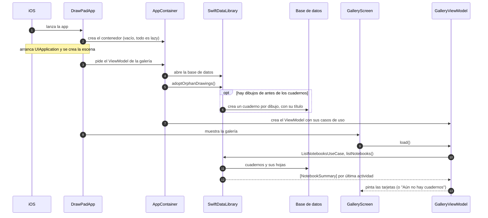
```mermaid
sequenceDiagram
    autonumber
    participant iOS
    participant App as DrawPadApp
    participant C as AppContainer
    participant L as SwiftDataLibrary
    participant DB as Base de datos
    participant G as GalleryScreen
    participant GVM as GalleryViewModel

    iOS->>App: lanza la app
    App->>C: crea el contenedor (vacío, todo es lazy)
    Note over iOS,App: arranca UIApplication y se crea la escena
    App->>C: pide el ViewModel de la galería
    C->>L: abre la base de datos
    C->>L: adoptOrphanDrawings()
    opt hay dibujos de antes de los cuadernos
        L->>DB: crea un cuaderno por dibujo, con su título
    end
    C->>GVM: crea el ViewModel con sus casos de uso
    App->>G: muestra la galería
    G->>GVM: load()
    GVM->>L: ListNotebooksUseCase, listNotebooks()
    L->>DB: cuadernos y sus hojas
    L-->>GVM: [NotebookSummary] por última actividad
    GVM-->>G: pinta las tarjetas (o "Aún no hay cuadernos")
```

### 5.2 Crear o abrir un cuaderno

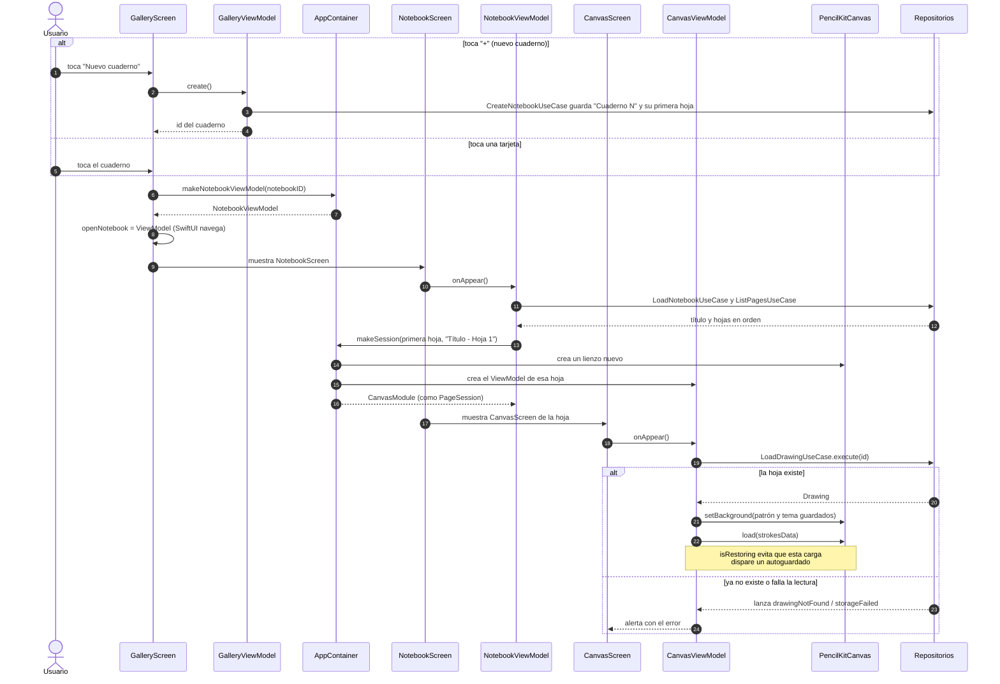
```mermaid
sequenceDiagram
    autonumber
    actor U as Usuario
    participant G as GalleryScreen
    participant GVM as GalleryViewModel
    participant C as AppContainer
    participant N as NotebookScreen
    participant NVM as NotebookViewModel
    participant V as CanvasScreen
    participant VM as CanvasViewModel
    participant K as PencilKitCanvas
    participant R as Repositorios

    alt toca "+" (nuevo cuaderno)
        U->>G: toca "Nuevo cuaderno"
        G->>GVM: create()
        GVM->>R: CreateNotebookUseCase guarda "Cuaderno N" y su primera hoja
        GVM-->>G: id del cuaderno
    else toca una tarjeta
        U->>G: toca el cuaderno
    end
    G->>C: makeNotebookViewModel(notebookID)
    C-->>G: NotebookViewModel
    G->>G: openNotebook = ViewModel (SwiftUI navega)
    G->>N: muestra NotebookScreen
    N->>NVM: onAppear()
    NVM->>R: LoadNotebookUseCase y ListPagesUseCase
    R-->>NVM: título y hojas en orden
    NVM->>C: makeSession(primera hoja, "Título - Hoja 1")
    C->>K: crea un lienzo nuevo
    C->>VM: crea el ViewModel de esa hoja
    C-->>NVM: CanvasModule (como PageSession)
    N->>V: muestra CanvasScreen de la hoja
    V->>VM: onAppear()
    VM->>R: LoadDrawingUseCase.execute(id)
    alt la hoja existe
        R-->>VM: Drawing
        VM->>K: setBackground(patrón y tema guardados)
        VM->>K: load(strokesData)
        Note over VM,K: isRestoring evita que esta carga<br/>dispare un autoguardado
    else ya no existe o falla la lectura
        R-->>VM: lanza drawingNotFound / storageFailed
        VM-->>V: alerta con el error
    end
```

### 5.3 Dibujar y autoguardar

Cada trazo reinicia un temporizador de 1 segundo. Solo cuando el usuario deja
de dibujar durante ese tiempo se guarda, **una vez** (*debounce*). Con los
trazos se guarda también la miniatura de la hoja.

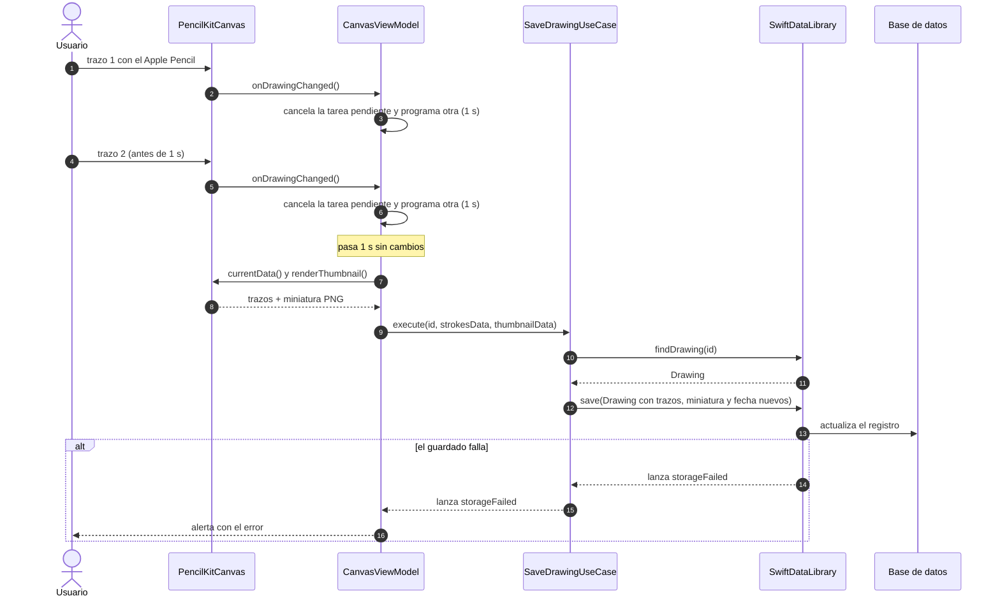
```mermaid
sequenceDiagram
    autonumber
    actor U as Usuario
    participant K as PencilKitCanvas
    participant VM as CanvasViewModel
    participant UC as SaveDrawingUseCase
    participant R as SwiftDataLibrary
    participant DB as Base de datos

    U->>K: trazo 1 con el Apple Pencil
    K->>VM: onDrawingChanged()
    VM->>VM: cancela la tarea pendiente y programa otra (1 s)
    U->>K: trazo 2 (antes de 1 s)
    K->>VM: onDrawingChanged()
    VM->>VM: cancela la tarea pendiente y programa otra (1 s)
    Note over VM: pasa 1 s sin cambios
    VM->>K: currentData() y renderThumbnail()
    K-->>VM: trazos + miniatura PNG
    VM->>UC: execute(id, strokesData, thumbnailData)
    UC->>R: findDrawing(id)
    R-->>UC: Drawing
    UC->>R: save(Drawing con trazos, miniatura y fecha nuevos)
    R->>DB: actualiza el registro
    alt el guardado falla
        R-->>UC: lanza storageFailed
        UC-->>VM: lanza storageFailed
        VM-->>U: alerta con el error
    end
```

### 5.4 Pasar de hoja, añadir y eliminar

La barra muestra `‹ Cuaderno 1 · Hoja 2 de 5 ⌄ › +`: las flechas pasan de
hoja, el **+** añade una al final y el título abre un menú con "Eliminar
esta hoja". "Nueva hoja" es un botón a la vista y no una opción del menú:
con una sola hoja las flechas están desactivadas, y sin el + no se veía cómo
añadir la segunda.

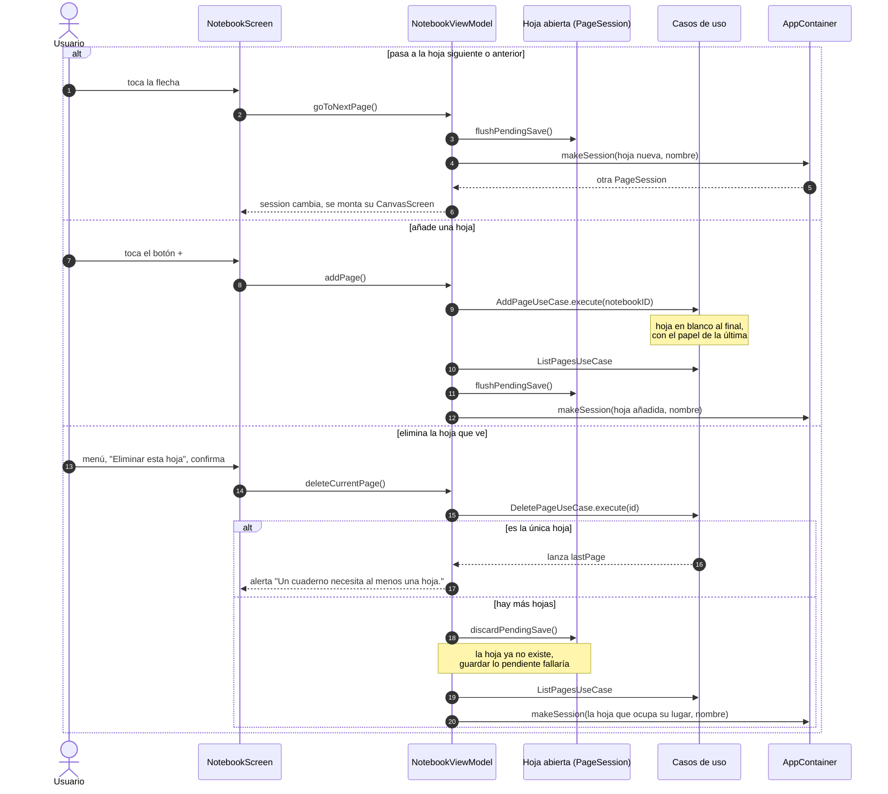
```mermaid
sequenceDiagram
    autonumber
    actor U as Usuario
    participant N as NotebookScreen
    participant NVM as NotebookViewModel
    participant S as Hoja abierta (PageSession)
    participant UC as Casos de uso
    participant C as AppContainer

    alt pasa a la hoja siguiente o anterior
        U->>N: toca la flecha
        N->>NVM: goToNextPage()
        NVM->>S: flushPendingSave()
        NVM->>C: makeSession(hoja nueva, nombre)
        C-->>NVM: otra PageSession
        NVM-->>N: session cambia, se monta su CanvasScreen
    else añade una hoja
        U->>N: toca el botón +
        N->>NVM: addPage()
        NVM->>UC: AddPageUseCase.execute(notebookID)
        Note over UC: hoja en blanco al final,<br/>con el papel de la última
        NVM->>UC: ListPagesUseCase
        NVM->>S: flushPendingSave()
        NVM->>C: makeSession(hoja añadida, nombre)
    else elimina la hoja que ve
        U->>N: menú, "Eliminar esta hoja", confirma
        N->>NVM: deleteCurrentPage()
        NVM->>UC: DeletePageUseCase.execute(id)
        alt es la única hoja
            UC-->>NVM: lanza lastPage
            NVM-->>N: alerta "Un cuaderno necesita al menos una hoja."
        else hay más hojas
            NVM->>S: discardPendingSave()
            Note over NVM,S: la hoja ya no existe,<br/>guardar lo pendiente fallaría
            NVM->>UC: ListPagesUseCase
            NVM->>C: makeSession(la hoja que ocupa su lugar, nombre)
        end
    end
```

### 5.5 Volver a la galería, salir de la app y acciones sobre un cuaderno

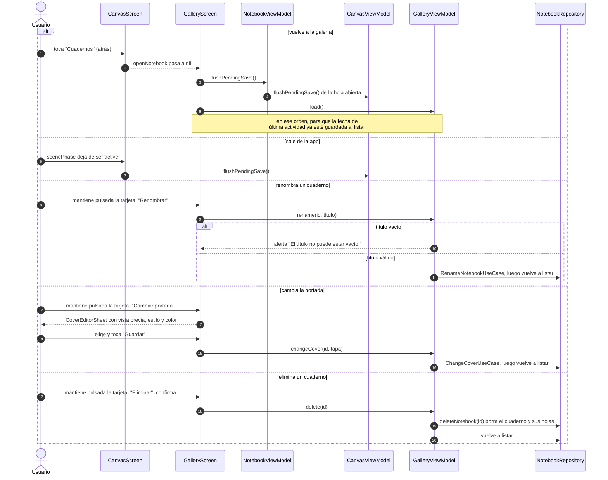
```mermaid
sequenceDiagram
    autonumber
    actor U as Usuario
    participant V as CanvasScreen
    participant G as GalleryScreen
    participant NVM as NotebookViewModel
    participant VM as CanvasViewModel
    participant GVM as GalleryViewModel
    participant R as NotebookRepository

    alt vuelve a la galería
        U->>V: toca "Cuadernos" (atrás)
        V-->>G: openNotebook pasa a nil
        G->>NVM: flushPendingSave()
        NVM->>VM: flushPendingSave() de la hoja abierta
        G->>GVM: load()
        Note over G,GVM: en ese orden, para que la fecha de<br/>última actividad ya esté guardada al listar
    else sale de la app
        U->>V: scenePhase deja de ser active
        V->>VM: flushPendingSave()
    else renombra un cuaderno
        U->>G: mantiene pulsada la tarjeta, "Renombrar"
        G->>GVM: rename(id, título)
        alt título vacío
            GVM-->>G: alerta "El título no puede estar vacío."
        else título válido
            GVM->>R: RenameNotebookUseCase, luego vuelve a listar
        end
    else cambia la portada
        U->>G: mantiene pulsada la tarjeta, "Cambiar portada"
        G-->>U: CoverEditorSheet con vista previa, estilo y color
        U->>G: elige y toca "Guardar"
        G->>GVM: changeCover(id, tapa)
        GVM->>R: ChangeCoverUseCase, luego vuelve a listar
    else elimina un cuaderno
        U->>G: mantiene pulsada la tarjeta, "Eliminar", confirma
        G->>GVM: delete(id)
        GVM->>R: deleteNotebook(id) borra el cuaderno y sus hojas
        GVM->>R: vuelve a listar
    end
```

### 5.6 Cambiar el papel de fondo

El papel tiene dos ajustes independientes: el **patrón** (blanco, cuadrícula,
líneas, puntos) y el **tema** (claro u oscuro). El diagrama muestra el
patrón; "Papel oscuro" sigue el mismo camino con `setTheme`.

El papel se guarda **al momento**, sin esperar al autoguardado: es un cambio
puntual, no una ráfaga como los trazos.

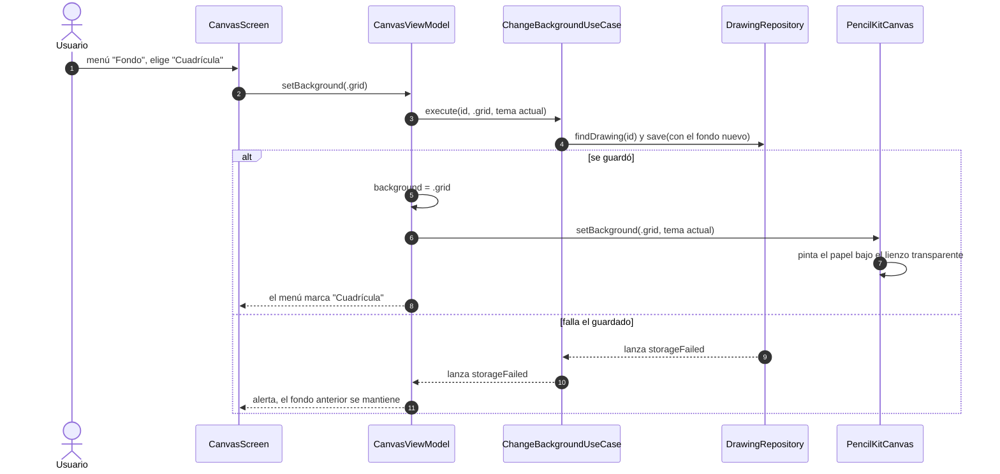
```mermaid
sequenceDiagram
    autonumber
    actor U as Usuario
    participant V as CanvasScreen
    participant VM as CanvasViewModel
    participant UC as ChangeBackgroundUseCase
    participant R as DrawingRepository
    participant K as PencilKitCanvas

    U->>V: menú "Fondo", elige "Cuadrícula"
    V->>VM: setBackground(.grid)
    VM->>UC: execute(id, .grid, tema actual)
    UC->>R: findDrawing(id) y save(con el fondo nuevo)
    alt se guardó
        VM->>VM: background = .grid
        VM->>K: setBackground(.grid, tema actual)
        K->>K: pinta el papel bajo el lienzo transparente
        VM-->>V: el menú marca "Cuadrícula"
    else falla el guardado
        R-->>UC: lanza storageFailed
        UC-->>VM: lanza storageFailed
        VM-->>V: alerta, el fondo anterior se mantiene
    end
```

### 5.7 Guardar en Fotos

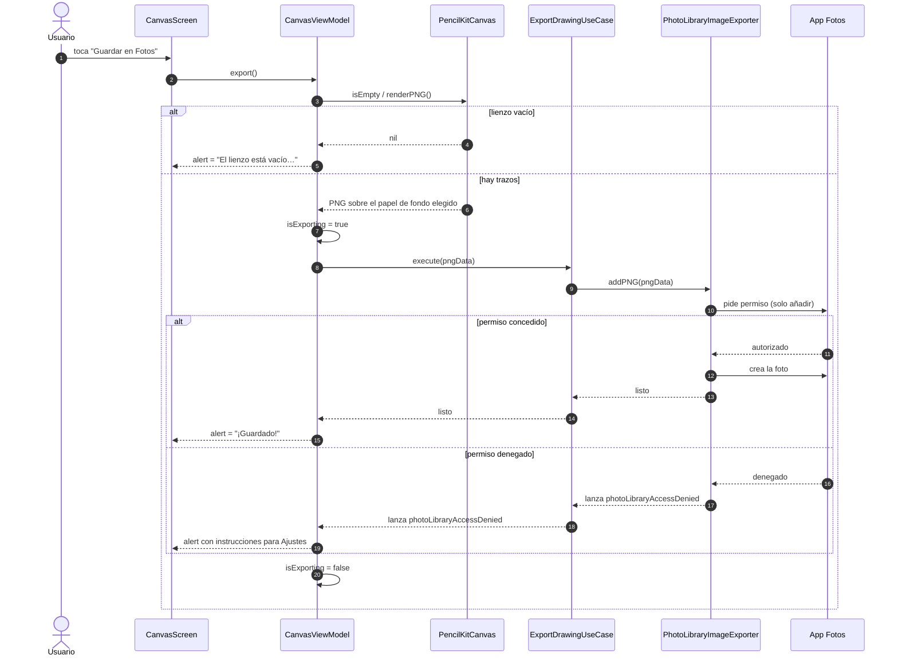
```mermaid
sequenceDiagram
    autonumber
    actor U as Usuario
    participant V as CanvasScreen
    participant VM as CanvasViewModel
    participant K as PencilKitCanvas
    participant UC as ExportDrawingUseCase
    participant X as PhotoLibraryImageExporter
    participant F as App Fotos

    U->>V: toca "Guardar en Fotos"
    V->>VM: export()
    VM->>K: isEmpty / renderPNG()
    alt lienzo vacío
        K-->>VM: nil
        VM-->>V: alert = "El lienzo está vacío…"
    else hay trazos
        K-->>VM: PNG sobre el papel de fondo elegido
        VM->>VM: isExporting = true
        VM->>UC: execute(pngData)
        UC->>X: addPNG(pngData)
        X->>F: pide permiso (solo añadir)
        alt permiso concedido
            F-->>X: autorizado
            X->>F: crea la foto
            X-->>UC: listo
            UC-->>VM: listo
            VM-->>V: alert = "¡Guardado!"
        else permiso denegado
            F-->>X: denegado
            X-->>UC: lanza photoLibraryAccessDenied
            UC-->>VM: lanza photoLibraryAccessDenied
            VM-->>V: alert con instrucciones para Ajustes
        end
        VM->>VM: isExporting = false
    end
```

### 5.8 Compartir como imagen o PDF

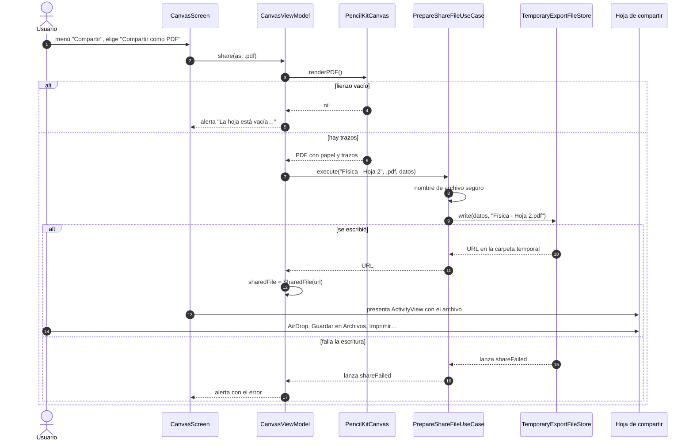
```mermaid
sequenceDiagram
    autonumber
    actor U as Usuario
    participant V as CanvasScreen
    participant VM as CanvasViewModel
    participant K as PencilKitCanvas
    participant UC as PrepareShareFileUseCase
    participant S as TemporaryExportFileStore
    participant iOS as Hoja de compartir

    U->>V: menú "Compartir", elige "Compartir como PDF"
    V->>VM: share(as: .pdf)
    VM->>K: renderPDF()
    alt lienzo vacío
        K-->>VM: nil
        VM-->>V: alerta "La hoja está vacía…"
    else hay trazos
        K-->>VM: PDF con papel y trazos
        VM->>UC: execute("Física - Hoja 2", .pdf, datos)
        UC->>UC: nombre de archivo seguro
        UC->>S: write(datos, "Física - Hoja 2.pdf")
        alt se escribió
            S-->>UC: URL en la carpeta temporal
            UC-->>VM: URL
            VM->>VM: sharedFile = SharedFile(url)
            V->>iOS: presenta ActivityView con el archivo
            U->>iOS: AirDrop, Guardar en Archivos, Imprimir…
        else falla la escritura
            S-->>UC: lanza shareFailed
            UC-->>VM: lanza shareFailed
            VM-->>V: alerta con el error
        end
    end
```

### 5.9 Suavizar trazos

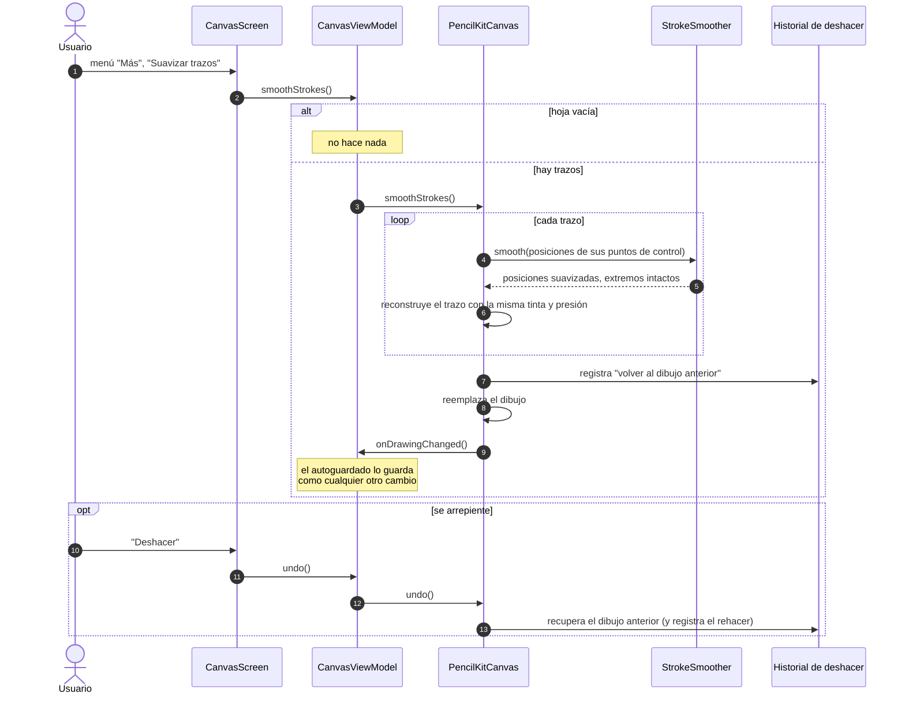
```mermaid
sequenceDiagram
    autonumber
    actor U as Usuario
    participant V as CanvasScreen
    participant VM as CanvasViewModel
    participant K as PencilKitCanvas
    participant S as StrokeSmoother
    participant UM as Historial de deshacer

    U->>V: menú "Más", "Suavizar trazos"
    V->>VM: smoothStrokes()
    alt hoja vacía
        Note over VM: no hace nada
    else hay trazos
        VM->>K: smoothStrokes()
        loop cada trazo
            K->>S: smooth(posiciones de sus puntos de control)
            S-->>K: posiciones suavizadas, extremos intactos
            K->>K: reconstruye el trazo con la misma tinta y presión
        end
        K->>UM: registra "volver al dibujo anterior"
        K->>K: reemplaza el dibujo
        K->>VM: onDrawingChanged()
        Note over VM: el autoguardado lo guarda<br/>como cualquier otro cambio
    end
    opt se arrepiente
        U->>V: "Deshacer"
        V->>VM: undo()
        VM->>K: undo()
        K->>UM: recupera el dibujo anterior (y registra el rehacer)
    end
```

### 5.10 Insertar texto, pegar y mover elementos

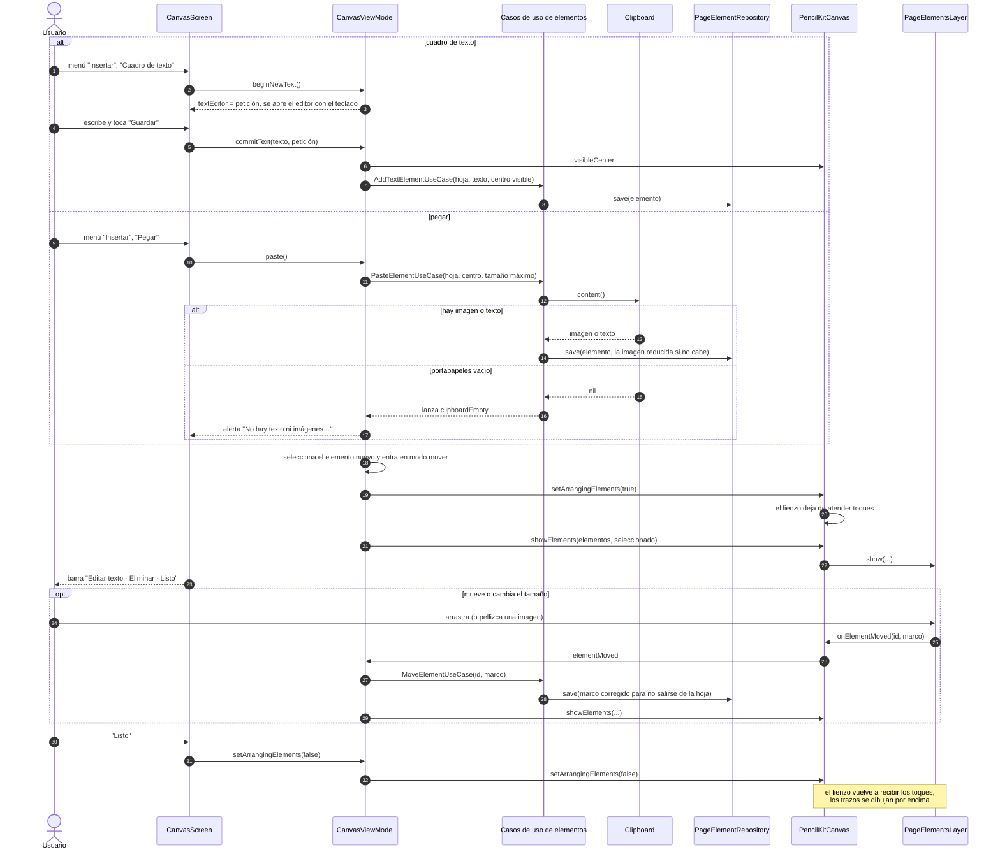
```mermaid
sequenceDiagram
    autonumber
    actor U as Usuario
    participant V as CanvasScreen
    participant VM as CanvasViewModel
    participant UC as Casos de uso de elementos
    participant CB as Clipboard
    participant R as PageElementRepository
    participant K as PencilKitCanvas
    participant L as PageElementsLayer

    alt cuadro de texto
        U->>V: menú "Insertar", "Cuadro de texto"
        V->>VM: beginNewText()
        VM-->>V: textEditor = petición, se abre el editor con el teclado
        U->>V: escribe y toca "Guardar"
        V->>VM: commitText(texto, petición)
        VM->>K: visibleCenter
        VM->>UC: AddTextElementUseCase(hoja, texto, centro visible)
        UC->>R: save(elemento)
    else pegar
        U->>V: menú "Insertar", "Pegar"
        V->>VM: paste()
        VM->>UC: PasteElementUseCase(hoja, centro, tamaño máximo)
        UC->>CB: content()
        alt hay imagen o texto
            CB-->>UC: imagen o texto
            UC->>R: save(elemento, la imagen reducida si no cabe)
        else portapapeles vacío
            CB-->>UC: nil
            UC-->>VM: lanza clipboardEmpty
            VM-->>V: alerta "No hay texto ni imágenes…"
        end
    end
    VM->>VM: selecciona el elemento nuevo y entra en modo mover
    VM->>K: setArrangingElements(true)
    K->>K: el lienzo deja de atender toques
    VM->>K: showElements(elementos, seleccionado)
    K->>L: show(...)
    V-->>U: barra "Editar texto · Eliminar · Listo"

    opt mueve o cambia el tamaño
        U->>L: arrastra (o pellizca una imagen)
        L->>K: onElementMoved(id, marco)
        K->>VM: elementMoved
        VM->>UC: MoveElementUseCase(id, marco)
        UC->>R: save(marco corregido para no salirse de la hoja)
        VM->>K: showElements(...)
    end
    U->>V: "Listo"
    V->>VM: setArrangingElements(false)
    VM->>K: setArrangingElements(false)
    Note over K,L: el lienzo vuelve a recibir los toques,<br/>los trazos se dibujan por encima
```

### 5.11 Dibujar la portada

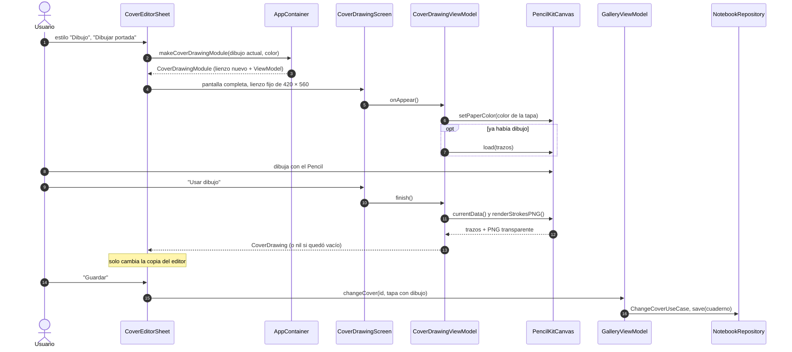
```mermaid
sequenceDiagram
    autonumber
    actor U as Usuario
    participant E as CoverEditorSheet
    participant C as AppContainer
    participant D as CoverDrawingScreen
    participant VM as CoverDrawingViewModel
    participant K as PencilKitCanvas
    participant GVM as GalleryViewModel
    participant R as NotebookRepository

    U->>E: estilo "Dibujo", "Dibujar portada"
    E->>C: makeCoverDrawingModule(dibujo actual, color)
    C-->>E: CoverDrawingModule (lienzo nuevo + ViewModel)
    E->>D: pantalla completa, lienzo fijo de 420 × 560
    D->>VM: onAppear()
    VM->>K: setPaperColor(color de la tapa)
    opt ya había dibujo
        VM->>K: load(trazos)
    end
    U->>K: dibuja con el Pencil
    U->>D: "Usar dibujo"
    D->>VM: finish()
    VM->>K: currentData() y renderStrokesPNG()
    K-->>VM: trazos + PNG transparente
    VM-->>E: CoverDrawing (o nil si quedó vacío)
    Note over E: solo cambia la copia del editor
    U->>E: "Guardar"
    E->>GVM: changeCover(id, tapa con dibujo)
    GVM->>R: ChangeCoverUseCase, save(cuaderno)
```

### 5.12 Figuras de diagrama y conexiones

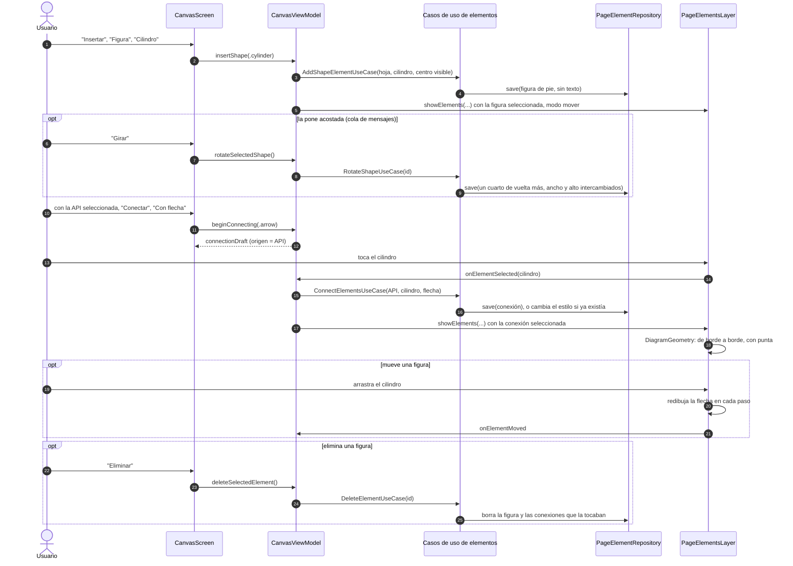
```mermaid
sequenceDiagram
    autonumber
    actor U as Usuario
    participant V as CanvasScreen
    participant VM as CanvasViewModel
    participant UC as Casos de uso de elementos
    participant R as PageElementRepository
    participant L as PageElementsLayer

    U->>V: "Insertar", "Figura", "Cilindro"
    V->>VM: insertShape(.cylinder)
    VM->>UC: AddShapeElementUseCase(hoja, cilindro, centro visible)
    UC->>R: save(figura de pie, sin texto)
    VM->>L: showElements(...) con la figura seleccionada, modo mover

    opt la pone acostada (cola de mensajes)
        U->>V: "Girar"
        V->>VM: rotateSelectedShape()
        VM->>UC: RotateShapeUseCase(id)
        UC->>R: save(un cuarto de vuelta más, ancho y alto intercambiados)
    end

    U->>V: con la API seleccionada, "Conectar", "Con flecha"
    V->>VM: beginConnecting(.arrow)
    VM-->>V: connectionDraft (origen = API)
    U->>L: toca el cilindro
    L->>VM: onElementSelected(cilindro)
    VM->>UC: ConnectElementsUseCase(API, cilindro, flecha)
    UC->>R: save(conexión), o cambia el estilo si ya existía
    VM->>L: showElements(...) con la conexión seleccionada
    L->>L: DiagramGeometry: de borde a borde, con punta

    opt mueve una figura
        U->>L: arrastra el cilindro
        L->>L: redibuja la flecha en cada paso
        L->>VM: onElementMoved
    end
    opt elimina una figura
        U->>V: "Eliminar"
        V->>VM: deleteSelectedElement()
        VM->>UC: DeleteElementUseCase(id)
        UC->>R: borra la figura y las conexiones que la tocaban
    end
```

### 5.13 Exportar e importar un cuaderno (iPad → iCloud Drive → iPhone)

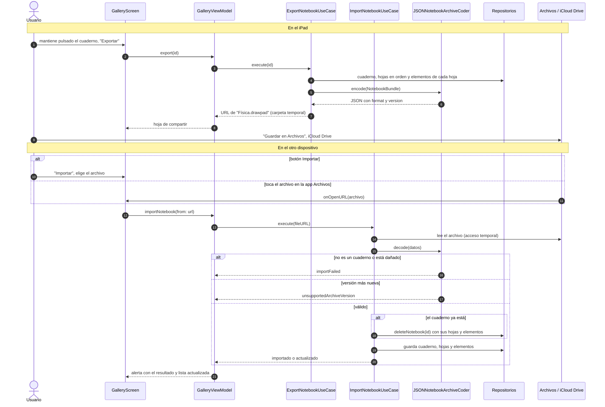
```mermaid
sequenceDiagram
    autonumber
    actor U as Usuario
    participant G as GalleryScreen
    participant GVM as GalleryViewModel
    participant EX as ExportNotebookUseCase
    participant IM as ImportNotebookUseCase
    participant C as JSONNotebookArchiveCoder
    participant R as Repositorios
    participant F as Archivos / iCloud Drive

    Note over U,F: En el iPad
    U->>G: mantiene pulsado el cuaderno, "Exportar"
    G->>GVM: export(id)
    GVM->>EX: execute(id)
    EX->>R: cuaderno, hojas en orden y elementos de cada hoja
    EX->>C: encode(NotebookBundle)
    C-->>EX: JSON con format y version
    EX-->>GVM: URL de "Física.drawpad" (carpeta temporal)
    GVM-->>G: hoja de compartir
    U->>F: "Guardar en Archivos", iCloud Drive

    Note over U,F: En el otro dispositivo
    alt botón Importar
        U->>G: "Importar", elige el archivo
    else toca el archivo en la app Archivos
        F->>G: onOpenURL(archivo)
    end
    G->>GVM: importNotebook(from: url)
    GVM->>IM: execute(fileURL)
    IM->>F: lee el archivo (acceso temporal)
    IM->>C: decode(datos)
    alt no es un cuaderno o está dañado
        C-->>GVM: importFailed
    else versión más nueva
        C-->>GVM: unsupportedArchiveVersion
    else válido
        alt el cuaderno ya está
            IM->>R: deleteNotebook(id) con sus hojas y elementos
        end
        IM->>R: guarda cuaderno, hojas y elementos
        IM-->>GVM: importado o actualizado
    end
    GVM-->>G: alerta con el resultado y lista actualizada
```

### 5.14 Insertar un diagrama de Mermaid

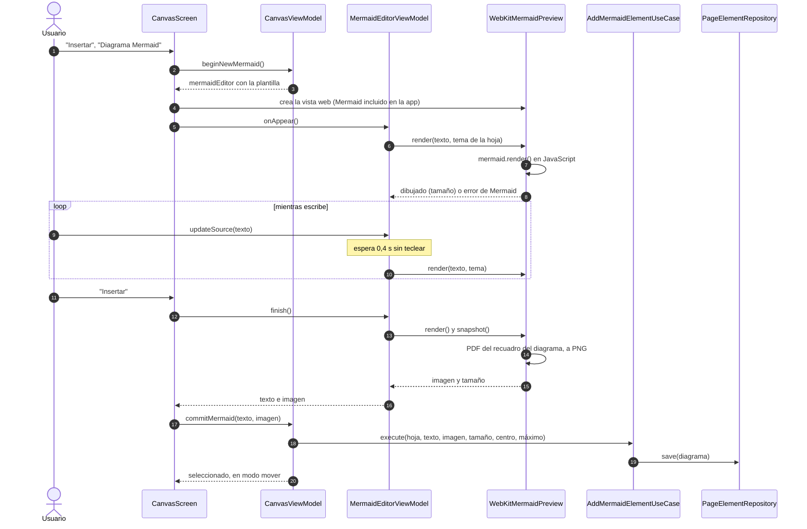
```mermaid
sequenceDiagram
    autonumber
    actor U as Usuario
    participant V as CanvasScreen
    participant VM as CanvasViewModel
    participant E as MermaidEditorViewModel
    participant W as WebKitMermaidPreview
    participant UC as AddMermaidElementUseCase
    participant R as PageElementRepository

    U->>V: "Insertar", "Diagrama Mermaid"
    V->>VM: beginNewMermaid()
    VM-->>V: mermaidEditor con la plantilla
    V->>W: crea la vista web (Mermaid incluido en la app)
    V->>E: onAppear()
    E->>W: render(texto, tema de la hoja)
    W->>W: mermaid.render() en JavaScript
    W-->>E: dibujado (tamaño) o error de Mermaid
    loop mientras escribe
        U->>E: updateSource(texto)
        Note over E: espera 0,4 s sin teclear
        E->>W: render(texto, tema)
    end
    U->>V: "Insertar"
    V->>E: finish()
    E->>W: render() y snapshot()
    W->>W: PDF del recuadro del diagrama, a PNG
    W-->>E: imagen y tamaño
    E-->>V: texto e imagen
    V->>VM: commitMermaid(texto, imagen)
    VM->>UC: execute(hoja, texto, imagen, tamaño, centro, máximo)
    UC->>R: save(diagrama)
    VM-->>V: seleccionado, en modo mover
```

### 5.15 Hojas Markdown: crear, escribir y leer

`NotebookViewModel` abre cada hoja según su tipo: `AppContainer` monta un
`CanvasModule` para las de dibujo y un `MarkdownPageModule` para las
Markdown. El resto del cuaderno (pasar, borrar, exportar) no distingue.

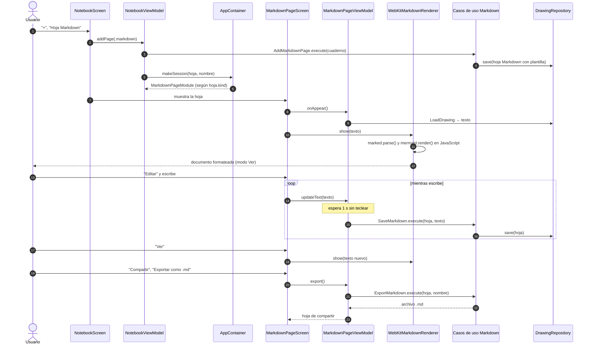
```mermaid
sequenceDiagram
    autonumber
    actor U as Usuario
    participant NV as NotebookScreen
    participant NVM as NotebookViewModel
    participant AC as AppContainer
    participant V as MarkdownPageScreen
    participant VM as MarkdownPageViewModel
    participant W as WebKitMarkdownRenderer
    participant UC as Casos de uso Markdown
    participant R as DrawingRepository

    U->>NV: "+", "Hoja Markdown"
    NV->>NVM: addPage(.markdown)
    NVM->>UC: AddMarkdownPage.execute(cuaderno)
    UC->>R: save(hoja Markdown con plantilla)
    NVM->>AC: makeSession(hoja, nombre)
    AC-->>NVM: MarkdownPageModule (según hoja.kind)
    NV->>V: muestra la hoja
    V->>VM: onAppear()
    VM->>R: LoadDrawing → texto
    V->>W: show(texto)
    W->>W: marked.parse() y mermaid.render() en JavaScript
    W-->>U: documento formateado (modo Ver)
    U->>V: "Editar" y escribe
    loop mientras escribe
        V->>VM: updateText(texto)
        Note over VM: espera 1 s sin teclear
        VM->>UC: SaveMarkdown.execute(hoja, texto)
        UC->>R: save(hoja)
    end
    U->>V: "Ver"
    V->>W: show(texto nuevo)
    U->>V: "Compartir", "Exportar como .md"
    V->>VM: export()
    VM->>UC: ExportMarkdown.execute(hoja, nombre)
    UC-->>VM: archivo .md
    VM-->>V: hoja de compartir
```

Importar un `.md` sigue el mismo camino que crear la hoja, pero
`ImportMarkdownPageUseCase` lee el archivo (UTF-8) y lo usa como texto.

## 6. Decisiones de diseño que conviene entender

**El dominio no conoce PencilKit.** `Drawing.strokesData` es `Data` opaco.
Quien sabe que dentro hay un `PKDrawing` es solo `PencilKitCanvas`. Si se
cambiara PencilKit por otro motor, Domain y Data no se tocarían.

**`DrawingCanvas` es un puerto de presentación, no de dominio.** Habla de
conceptos de pantalla (deshacer, dibujar con el dedo, renderizar), así que
vive en Presentation. Existe para poder probar el ViewModel con
`FakeDrawingCanvas`.

**La exportación recibe un PNG ya hecho.** Convertir trazos en imagen
necesita PencilKit y UIKit, por eso lo hace el lienzo. El caso de uso solo
valida y delega en `ImageLibrary`.

**Compartir pasa por un archivo temporal.** La hoja de compartir de iOS
necesita un archivo con nombre y extensión para ofrecer "Guardar en
Archivos" o AirDrop con un nombre útil. El caso de uso decide el nombre (a
partir del título, sin caracteres prohibidos) y el puerto `ExportFileStore`
lo escribe; la carpeta temporal se vacía en cada exportación.

**El PDF lleva una imagen, no vectores.** PencilKit no expone los trazos
como curvas vectoriales, así que la página del PDF contiene el dibujo a
triple resolución sobre su papel.

**Inyección de dependencias manual.** Con tres pantallas no hace falta una
librería: `AppContainer` crea todo y lo pasa por los `init`.

**Entidad de dominio y modelo de base de datos son tipos distintos.**
`Notebook` y `Drawing` son `struct` sin dependencias; `NotebookRecord` y
`DrawingRecord` son las clases `@Model` que SwiftData sabe guardar. La
biblioteca (`SwiftDataLibrary`) convierte entre ambos.
Cuesta unas líneas de mapeo y evita que SwiftData se cuele en el dominio y en
las vistas (ver [ADR 0007](adr/0007-swiftdata.md)).

**El papel de fondo no es parte de los trazos.** `PencilKitCanvas` muestra
dos vistas apiladas: abajo el papel (un color con patrón repetido) y arriba
el `PKCanvasView` transparente. Cambiar de papel no toca el dibujo, y al
exportar se pinta primero el papel y luego los trazos. Las miniaturas van
sobre papel liso: el patrón reducido las ensucia.

**Textos e imágenes van en una capa bajo los trazos.** `PencilKitCanvas`
apila tres vistas: papel, `PageElementsLayer` y el `PKCanvasView`
transparente. Los elementos se ven a través del lienzo y lo que se dibuja
queda encima. Como el lienzo se lleva todos los toques, mover elementos es
un **modo aparte**: mientras dura, el lienzo no atiende toques y los recibe
la capa. Los elementos no son trazos: cada uno es una fila de la base de
datos y se guarda al momento, no con el autoguardado
(ver [ADR 0013](adr/0013-textos-e-imagenes.md)).

**En el iPhone, Markdown y diagramas pero no trazos, decidido una vez.**
`AppContainer` calcula `EditingCapabilities` (`.phone` en el iPhone, o con
`-phoneMode` en las pruebas; `.full` en el iPad) y lo reparte con el entorno
de SwiftUI (`\.editing`). Cada pantalla esconde lo que no aplica según su
permiso: cuadernos (`canManageNotebooks`), trazos (`canDraw`), figuras,
conexiones y Mermaid (`canEditDiagrams`) o Markdown (`canWriteMarkdown`). En
el iPhone, la barra del lienzo se queda con *Insertar* y *Compartir*. El lienzo se crea en modo
lectura: sin paleta, sin gesto de dibujo y con la hoja ajustada al ancho
(`CanvasGeometry.fitWidthZoom`). Los ViewModel y los casos de uso no cambian
(ver [ADR 0018](adr/0018-iphone-solo-lectura.md),
[ADR 0021](adr/0021-markdown-en-iphone.md) y
[ADR 0022](adr/0022-diagramas-en-iphone.md)).

**Exportar es un formato propio, versionado y separado del dominio.** El
archivo `.drawpad` es un JSON con `format` y `version`, y tipos propios
(`ArchiveFile`, `PageDTO`…) en vez de las entidades. Así cambiar una entidad
no cambia el formato sin querer, y una versión futura se reconoce y se
rechaza con un mensaje claro. **Importar reemplaza** el cuaderno si ya está
(mismo identificador), para que el ida y vuelta iPad → iPhone actualice la
copia en vez de duplicarla (ver [ADR 0017](adr/0017-exportar-importar-cuadernos.md)).

**Las figuras son elementos y las conexiones también.** Una figura es un
`PageElement` con un `DiagramShape` (tipo, texto, giro); una conexión es un
`PageElement` con un `Connector` que solo guarda los dos extremos. La línea
no tiene posición propia: se calcula cada vez, de borde a borde, a partir de
los marcos actuales (`DiagramGeometry`). Por eso sigue a las figuras al
moverlas o girarlas, y por eso quitar una figura quita sus conexiones (regla
de `DeleteElementUseCase`). Girar es de 90 en 90°: basta con intercambiar
ancho y alto, y el dibujo del cilindro cambia de orientación
(ver [ADR 0016](adr/0016-figuras-de-diagrama.md)).

**Mermaid se dibuja en la presentación y se guarda como texto e imagen.**
La librería Mermaid (JavaScript) va dentro de la app y corre en una vista web
sin conexión (`WebKitMermaidPreview`, el único sitio que conoce WebKit). El
editor dibuja una vista previa visible y de ella sale la imagen; el dominio
recibe el texto y el PNG ya hechos, como recibe el PNG al exportar. La hoja
muestra la imagen como cualquier elemento, bajo los trazos, y el texto se
guarda para volver a editarlo (ver [ADR 0019](adr/0019-hojas-mermaid.md)).

**Una hoja Markdown es otra clase de hoja, no un elemento.** `Drawing.kind`
dice si la hoja es de dibujo o Markdown; el cuaderno solo pide a
`makeSession` "abre esta hoja" y `AppContainer` elige la pantalla. El texto
se guarda tal cual en `Drawing.markdown` y se formatea al mostrarlo, con
marked y Mermaid dentro de una vista web sin red
(`WebKitMarkdownRenderer`). El HTML que traiga el documento se muestra como
texto, nunca se ejecuta (ver [ADR 0020](adr/0020-hojas-markdown.md)).

**El portapapeles es un puerto.** `PasteElementUseCase` no sabe qué es
`UIPasteboard`: pide a `Clipboard` "qué hay copiado". Así la lógica de pegar
(texto o imagen, reducir si no cabe, qué hacer si está vacío) se prueba con
un portapapeles falso, y las pruebas de interfaz usan uno fijo para no
depender del aviso de permiso de iOS.

**Suavizar es una operación del lienzo, con el algoritmo aparte.** El
ViewModel solo pide `smoothStrokes()`; cómo se recorre y reconstruye cada
trazo es asunto de PencilKit y vive en el adaptador. La matemática (una
media móvil sobre puntos) está en `StrokeSmoother`, sin PencilKit, con
pruebas numéricas. Reemplazar el dibujo a mano no se puede deshacer por
defecto, así que el adaptador lo registra él mismo en el historial; "Borrar
todo" usa el mismo camino y también se puede deshacer
(ver [ADR 0011](adr/0011-suavizar-trazos.md)).

**Zoom y desplazamiento son cosa del adaptador.** `PKCanvasView` es un
`UIScrollView`: basta con darle límites de zoom y un tamaño de contenido.
Ni el dominio ni el ViewModel saben que existe el zoom, y no se guarda. Las
cuentas (tamaño de la hoja, dónde va el papel para acompañar a los trazos)
están en `CanvasGeometry`, sin UIKit, para poder probarlas
(ver [ADR 0009](adr/0009-zoom-y-tamano-de-hoja.md)).

**El aspecto del lienzo lo decide el papel, no el sistema.** La app sigue el
modo claro u oscuro del iPad, pero cada lienzo usa el tema de su dibujo
(`overrideUserInterfaceStyle`). PencilKit adapta la tinta al aspecto: sobre
papel oscuro, el negro se muestra blanco. Los trazos guardados no cambian;
al exportar se fija el mismo aspecto para que la imagen sea lo que se ve
(ver [ADR 0008](adr/0008-papel-y-tema-por-dibujo.md)).

**Las columnas añadidas después son opcionales en la base de datos.**
`DrawingRecord` guarda `backgroundRaw`, `themeRaw` y `notebookID` como
opcionales, y `NotebookRecord` hace lo mismo con el color y el estilo de la
tapa. Al serlo, SwiftData la añade sola a
las bases de datos ya instaladas (migración ligera); los dibujos antiguos las
tienen vacías: el papel se lee como blanco liso, y a cada dibujo sin
cuaderno se le crea uno al arrancar (`adoptOrphanDrawings`).

**Un cuaderno es una carpeta de hojas, y nunca está vacío.** `Notebook`
solo tiene título y fecha; cada `Drawing` (hoja) apunta a su cuaderno con
`notebookID`. Las hojas se ordenan por fecha de creación. Crear un cuaderno
crea su primera hoja, y `DeletePageUseCase` se niega a borrar la última:
esas dos reglas están en los casos de uso, no en las vistas
(ver [ADR 0010](adr/0010-cuadernos-y-hojas.md)).

**Una sola clase para los tres repositorios.** `SwiftDataLibrary` implementa
`NotebookRepository`, `DrawingRepository` y `PageElementRepository` porque
comparten un mismo `ModelContext`: dos contextos no ven al momento los
cambios del otro, y borrar un cuaderno toca las tres tablas (sus hojas y los
elementos de cada hoja). Los casos de uso siguen pidiendo
solo el puerto que necesitan.

**El cuaderno no conoce el lienzo.** `NotebookViewModel` decide qué hoja se
ve, pero solo le pide a la hoja abierta "guarda ya" o "descarta lo
pendiente" a través de `PageSession`. Quien implementa ese protocolo es
`CanvasModule`; en las pruebas, un doble sin PencilKit.

**Cada hoja abierta tiene lienzo y ViewModel propios.** Al cambiar de hoja
se crean de nuevo. Lo que debe sobrevivir al cambio vive fuera:
`CanvasPreferences` (dibujar con el dedo) y una única paleta de herramientas
compartida (lápiz y color elegidos).

**La portada dibujada se guarda dos veces.** Los trazos, para seguir
editándola, y una imagen PNG transparente, para que la galería la muestre sin
crear un lienzo de PencilKit por cada tarjeta. Al ser transparente, el color
de la tapa se ve debajo y se puede cambiar sin volver a dibujar. El lienzo de
la portada tiene un tamaño fijo, en la proporción de la tapa, para que el
dibujo encaje igual en cualquier orientación
(ver [ADR 0015](adr/0015-portada-dibujada.md)).

**La tapa es un dato, no un dibujo.** `NotebookCover` son dos valores (color
y estilo); `NotebookCoverView` la pinta con el título encima. La misma vista
sirve para la tarjeta de la galería y para la vista previa del editor. Los
nombres y los tonos de cada color viven en Presentation
(ver [ADR 0012](adr/0012-portada-disenada.md)).

**Resúmenes para listar.** La galería usa `NotebookSummary` (título, tapa,
número de hojas, última actividad) y el cuaderno usa `DrawingSummary`: ni
una ni otro cargan los trazos.

**La navegación vive en `GalleryScreen`.** Guarda el `NotebookViewModel`
abierto y SwiftUI navega mientras no sea `nil`. Se crea **una vez**, al tocar
la tarjeta: crearlo dentro del cuerpo de una vista lo repetiría en cada
repintado. Dentro del cuaderno no hay navegación: `NotebookScreen` cambia la
hoja que muestra.

**El contenedor crea todo de forma diferida (`lazy`).** `DrawPadApp.init()`
se ejecuta antes de que exista `UIApplication`. Un `PKCanvasView` creado en
ese momento deja sus reconocedores de gestos mal inicializados y la app se
cierra al primer toque con el dedo (el Apple Pencil no lo provocaba). Por eso
las vistas de UIKit se crean cuando la escena ya está en marcha. Las pruebas
de interfaz (`DrawPadUITests`) vigilan que no vuelva a pasar.

**Concurrencia.** El ViewModel y el lienzo son `@MainActor` (todo lo que toca
la interfaz va en el hilo principal). El temporizador de autoguardado es una
`Task` que se cancela y se vuelve a crear con cada cambio.

## 7. Pruebas

| Qué se prueba | Archivo | Cómo |
| ------------- | ------- | ---- |
| Casos de uso | `Domain/UseCasesTests.swift`, `Domain/PageElementUseCasesTests.swift` | Biblioteca en memoria, portapapeles falso y dobles espía. |
| Formato `.drawpad` | `Data/JSONNotebookArchiveCoderTests.swift` | Escribir y volver a leer un cuaderno completo; archivos dañados, de otra app o de una versión futura. |
| Exportar e importar | `Domain/NotebookArchiveUseCasesTests.swift` | Biblioteca en memoria y formato falso; incluye el reemplazo de un cuaderno que ya existe. |
| Biblioteca SwiftData | `Data/SwiftDataLibraryTests.swift` | Base de datos real, en memoria. Incluye la migración de dibujos sin cuaderno. |
| Archivos para compartir | `Data/TemporaryExportFileStoreTests.swift` | Carpeta temporal real. |
| ViewModel del lienzo | `Presentation/CanvasViewModelTests.swift` | Lienzo falso; el autoguardado se prueba con un retardo de milisegundos. |
| Cuentas del zoom | `Presentation/CanvasGeometryTests.swift` | Funciones puras, sin vistas; incluye el ajuste al ancho del iPhone. |
| Modo iPhone | `DrawPadUITests/PhoneUITests.swift` | Simulador de iPad con `-phoneMode` y un cuaderno de ejemplo. |
| Permisos por dispositivo | `Presentation/EditingCapabilitiesTests.swift` | Qué se puede cambiar en iPad y en iPhone. |
| Editor de Mermaid | `Presentation/MermaidEditorViewModelTests.swift` | Motor falso: espera al teclear, errores, imagen final. |
| Mermaid real | `Presentation/WebKitMermaidPreviewTests.swift` | WebKit y la librería incluida: un diagrama válido se dibuja y da imagen; uno roto da el error de Mermaid. |
| Suavizado | `Presentation/StrokeSmootherTests.swift` | Líneas de ejemplo: una recta no cambia, un zigzag se aplana, los extremos no se mueven. |
| ViewModel de la galería | `Presentation/GalleryViewModelTests.swift` | Biblioteca en memoria. |
| ViewModel del cuaderno | `Presentation/NotebookViewModelTests.swift` | Biblioteca en memoria y hojas abiertas falsas. |

| Pantallas reales | `DrawPadUITests/*UITests.swift` (una clase por tema) | Lanza la app en el simulador (con `-uiTesting`: base de datos vacía en memoria), crea cuadernos y hojas, navega y toca el lienzo con el "dedo". |

`PencilKitCanvas`, `PhotoLibraryImageExporter` y las vistas no tienen pruebas
unitarias: son adaptadores finos sobre frameworks de Apple. Las pruebas de
interfaz comprueban que no se cierran; el Apple Pencil y Fotos se verifican a
mano en el iPad.

## 8. Cómo añadir una funcionalidad

Ejemplo: "compartir el dibujo".

1. **Domain:** si hace falta algo externo, define un protocolo en
   `Domain/Repositories` y un caso de uso en `Domain/UseCases`.
2. **Data:** implementa el protocolo.
3. **Presentation:** añade la acción al ViewModel que toque y el botón a su
   pantalla.
4. **App:** conecta la implementación en `AppContainer`.
5. **Pruebas:** un doble en `DrawPadTests/Doubles` y los casos nuevos.
6. Si la decisión es importante (una librería, un cambio de estructura),
   escribe un [ADR](adr/README.md).
